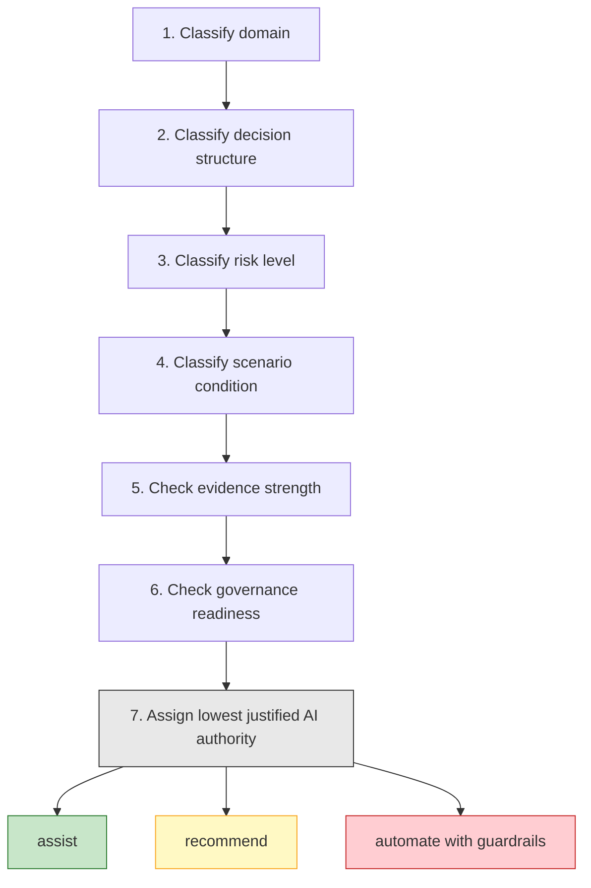
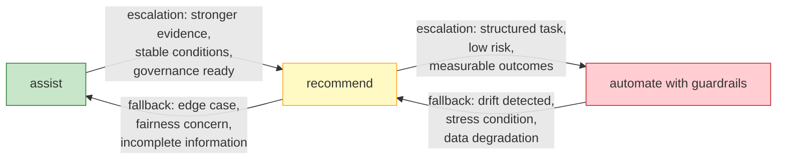
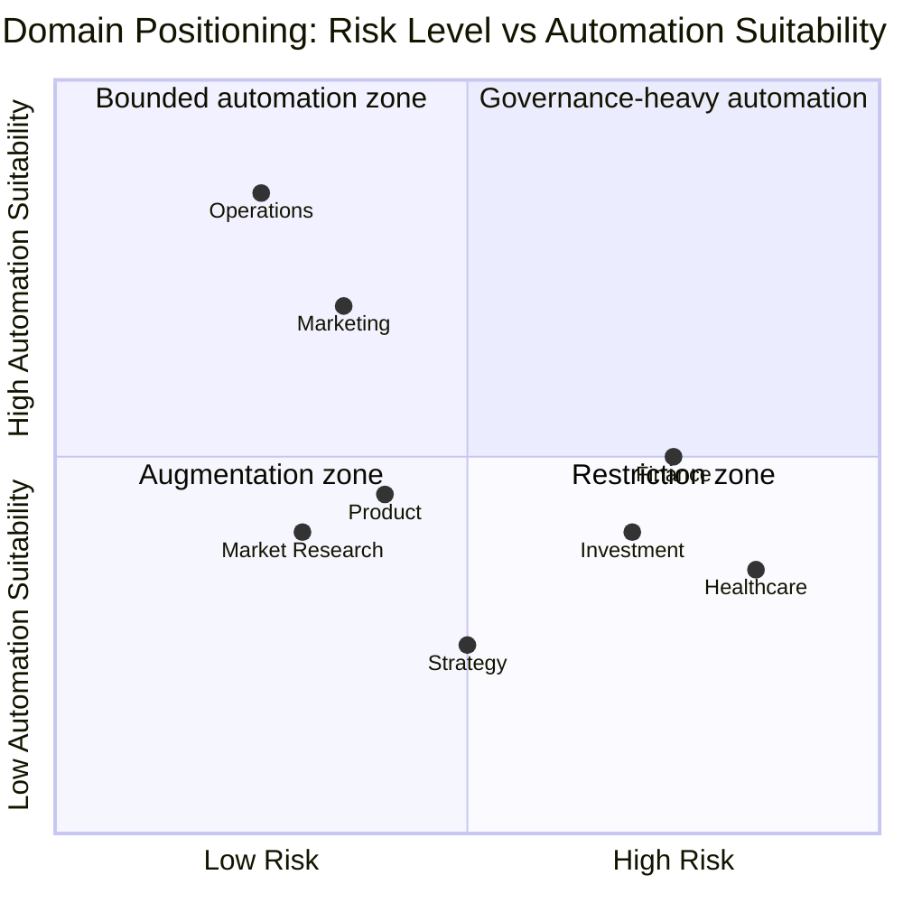
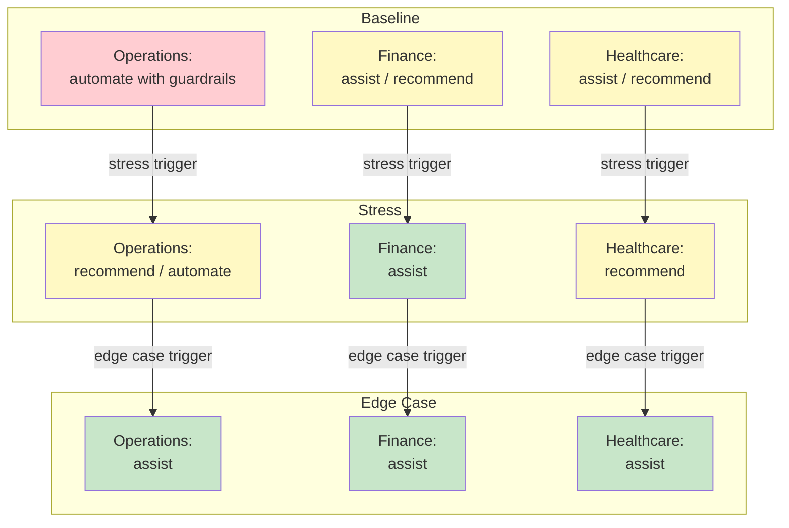
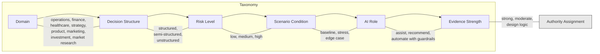
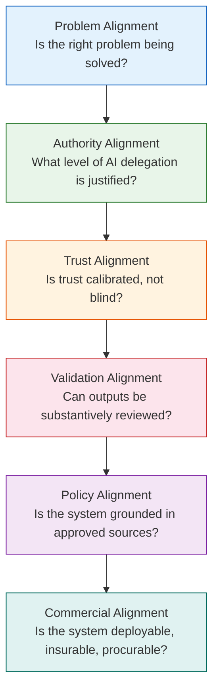

# Visual Diagrams

status: completed
purpose: Provide visual representations of the core analytical framework, decision logic, and domain comparison from the thinktank report.

## 1. Seven-Step AI Authority Decision Sequence

## 2. AI Role Spectrum with Escalation and Fallback

## 3. Domain Positioning by Risk and Automation Suitability

## 4. Scenario-Dependent Authority Shift

## 5. Six-Part Category Taxonomy

## 6. Business-Context AI Alignment Layers

## Rendering Note

These diagrams use Mermaid syntax. They render natively in GitHub, GitLab, VS Code (with Mermaid extension), Obsidian, and most modern markdown viewers. For PDF or print output, use a Mermaid CLI tool or online renderer.
